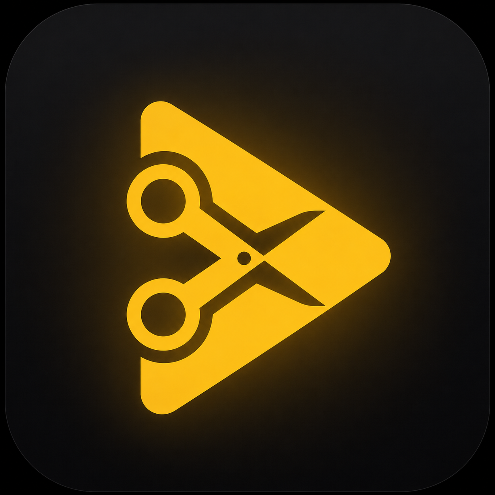
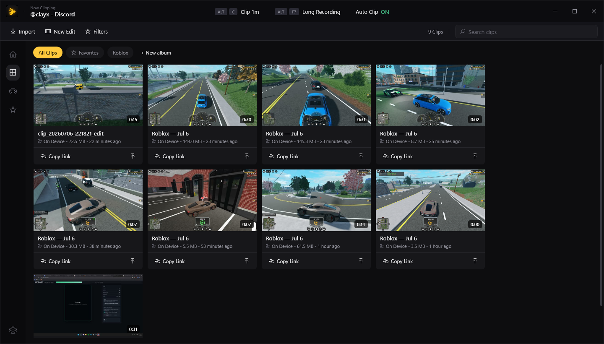
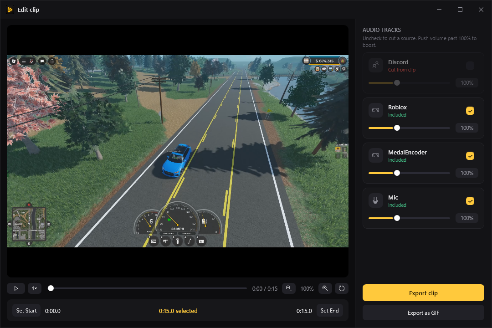
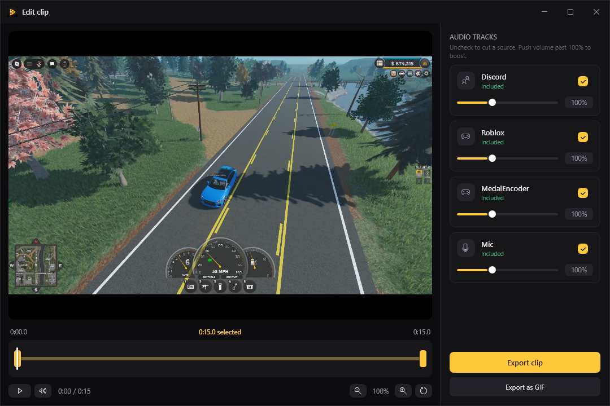

<div align="center">



# Clyppr

### Clip the game. Cut the Discord.

Always-on replay buffer, one-hotkey clips, and **per-app audio on separate tracks** —
so your clips keep the game and drop the voice chat. A real trim/mix editor,
drag-straight-to-Discord sharing, and nothing ever leaves your PC.

[](https://github.com/izoose/clyppr/releases/latest/download/Clyppr-Setup-x64.exe)
[](https://github.com/izoose/clyppr/releases)
[](LICENSE)

**[clyppr.com](https://clyppr.com)** · Built in C# / .NET 8 (WPF)



</div>

## Features

- **Replay buffer + hotkey** — always recording the last N seconds; press **ALT+C** (configurable) to save a clip. Screenshot hotkey too (**ALT+S**).
- **Per-app audio tracks** — each clip is one MP4 with separate *Desktop / Voice / Mic* audio tracks. Cut Discord, keep the game — no re-recording.
- **Real editor** — timeline trim with draggable handles, a per-track mixer (keep/cut/boost each source to 300%, previewed live), frame zoom & pan, export to MP4 or GIF.
- **Library** — Medal-style dark grid: thumbnails, hover-to-preview, search, favorites, rename, delete, import, auto-titled by the detected game.
- **Share** — drag the clip straight into Discord, copy the file to paste with Ctrl+V, or save a copy. No account, no upload.
- **Runs in the tray** — starts with Windows (optional), sips resources while you play.

## Download

Grab the latest installer and run it — no .NET or ffmpeg to install, it's all bundled:

### [⬇ Download Clyppr for Windows](https://github.com/izoose/clyppr/releases/latest/download/Clyppr-Setup-x64.exe)

The installer is per-user (no admin prompt) and installs to `%LocalAppData%\Programs\Clyppr`.
It's unsigned, so Windows SmartScreen may warn once — click **More info → Run anyway**.

## Requirements

- Windows 10 (2004 / build 19041) or Windows 11. Per-app audio separation needs build 20348+.
- A GPU with a hardware H.264 encoder (NVIDIA NVENC is the primary target; AMD/Intel also work).

> Some "debloated" gaming PCs disable the Windows `CaptureService`, which breaks the modern
> capture API — Clyppr automatically falls back to DXGI Desktop Duplication, which works without it.

## Build from source

Requires the **.NET 8 SDK**.

```bash
dotnet build Clipper.sln
dotnet run --project src/Clipper.App     # needs ffmpeg on PATH for dev runs
```

### Build the release installer

Requires the .NET 8 SDK and [Inno Setup 6](https://jrsoftware.org/isdl.php)
(`winget install JRSoftware.InnoSetup`). ffmpeg is downloaded automatically.

```powershell
pwsh scripts/package.ps1            # -> dist/Clyppr-Setup-x64.exe
```

Or just the self-contained exe (no installer):

```powershell
./build-release.ps1                 # -> publish/Clyppr.exe
```

## How it works

<div align="center">
 
</div>

- **`src/Clipper.Engine`** — capture (Windows Graphics Capture with a DXGI Desktop Duplication fallback), per-app audio (WASAPI process-loopback), the recorder, replay buffer, and global hotkey.
- **`src/Clipper.Core`** — library (SQLite), settings, ffprobe/thumbnails, exporter.
- **`src/Clipper.App`** — WPF UI (library, editor, share, settings, tray).
- **`installer/`**, **`scripts/`** — Inno Setup script + release/ffmpeg build scripts.
- **`site/`** — the clyppr.com landing page (deployed via GitHub Pages).

> Internally the assemblies keep the `Clipper.*` namespace; the shipped product and
> executable are **Clyppr**.

## License

[MIT](LICENSE) © izoose. Clyppr bundles FFmpeg (GPL) as a separate program —
see [THIRD-PARTY-NOTICES.md](THIRD-PARTY-NOTICES.md).
